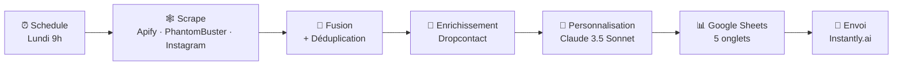

# Prospection Hebdomadaire — Industrie de l'Événementiel France 🇫🇷

> Un workflow n8n qui scrape, enrichit, personnalise et expédie **500+ emails de prospection par semaine** dans l'industrie de l'événementiel en France — 100 % automatisé, personnalisé par IA, et pensé RGPD.

[🇬🇧 Read in English](./README.md)

---

## Le problème

Agences et freelances qui ciblent l'événementiel français jonglent habituellement entre 5 à 6 outils pour leur prospection à froid :
recherches Google Maps, LinkedIn Sales Navigator, Instagram, trouveurs d'emails, un rédacteur IA, un outil d'envoi, et une feuille de calcul pour tout recoller. Ce travail engloutit **8 à 10 heures par semaine** et se casse dès qu'une API change.

## La solution

Un seul workflow n8n qui tourne **tous les lundis à 9 h** et produit des emails de prospection personnalisés, prêts à partir dans Instantly.ai, pour cinq segments distincts :

1. Wedding Planners
2. Festivals
3. Event Managers
4. Théâtres
5. Jeunes Artistes

## Architecture



Architecture détaillée : [`docs/architecture.md`](./docs/architecture.md)

## Stack technique

| Couche               | Outil                                        |
|----------------------|----------------------------------------------|
| Orchestration        | **n8n** (auto-hébergé)                       |
| Scraping             | Apify (Google Places + Instagram), PhantomBuster (LinkedIn) |
| Enrichissement email | Dropcontact                                  |
| Personnalisation IA  | **Anthropic Claude 3.5 Sonnet**              |
| Stockage             | Google Sheets                                |
| Envoi                | Instantly.ai                                 |

## Résultats

- **58 nœuds**, 5 branches de scraping parallèles, 1 étape IA
- ~**8–12 min** par exécution hebdo (vs 8–10 h en manuel)
- ~**54 € / semaine en coût variable** pour 500 leads (détail dans [setup.md](./docs/setup.md))
- Zéro copier-coller manuel entre outils

## Démarrage rapide

```bash
# 1. Cloner
git clone https://github.com/MarcDarin/n8n-weekly-prospecting-event-industry-fr.git
cd n8n-weekly-prospecting-event-industry-fr

# 2. n8n → Workflows → Importer depuis un fichier
#    Choisir : workflows/weekly-prospecting-event-industry-fr.json

# 3. Copie .env.example dans ton gestionnaire de mots de passe,
#    puis colle chaque valeur dans les credentials n8n correspondants.
```

Installation complète (≈ 30–45 min) : [`docs/setup.md`](./docs/setup.md)

## Sécurité

- Le JSON du workflow ne contient **que des placeholders** — aucun vrai token.
- Ne jamais committer un `.env`. Un `.gitignore` est déjà en place.
- Rotate toute clé d'API qui aurait été poussée sur un repo public, même brièvement.

## Roadmap

- [ ] Remplacer le stub Dropcontact (Code node) par le nœud officiel n8n
- [ ] Ajouter un sous-workflow d'error-handling qui ping Slack en cas d'échec
- [ ] Dossier `test/` avec réponses Apify mockées pour intégration CI
- [ ] Support multi-pays (BE / CH en premier)

## À propos

Par **Marc Darin** — consultant automatisation & IA (n8n · serveurs MCP · Claude).
Si tu veux un système similaire pour ta niche : [marcxdart@gmail.com](mailto:marcxdart@gmail.com).

## Licence

MIT — voir [LICENSE](./LICENSE).
