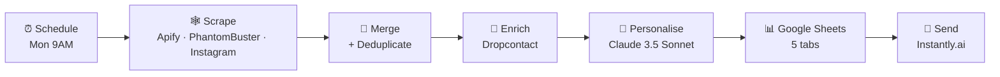

# Weekly Prospecting — Event Industry France 🇫🇷

> An n8n workflow that scrapes, enriches, personalises and dispatches **500+ cold-outreach emails per week** across the French event industry — fully automated, AI-personalised, GDPR-aware.

[🇫🇷 Lire en français](./README.fr.md)

---

## The problem

Agencies and freelancers targeting the French event industry typically juggle 5–6 tools to run cold outreach:
Google Maps lookups, LinkedIn Sales Nav, Instagram searches, email finders, an AI writer, a sending tool, and a spreadsheet glueing it all together. That work eats **8–10 hours per week** and breaks the moment one API changes.

## The solution

A single n8n workflow that runs **every Monday at 9 AM** and produces ready-to-send, personalised cold emails into Instantly.ai for five distinct segments:

1. Wedding Planners
2. Festivals
3. Event Managers
4. Théâtres
5. Jeunes Artistes

## Architecture



Full architecture: [`docs/architecture.md`](./docs/architecture.md)

## Tech stack

| Layer               | Tool                                       |
|---------------------|--------------------------------------------|
| Orchestration       | **n8n** (self-hosted)                      |
| Scraping            | Apify (Google Places + Instagram), PhantomBuster (LinkedIn) |
| Email enrichment    | Dropcontact                                |
| AI personalisation  | **Anthropic Claude 3.5 Sonnet**            |
| Storage             | Google Sheets                              |
| Delivery            | Instantly.ai                               |

## Results

- **58 nodes**, 5 parallel scraping branches, 1 AI step
- ~**8–12 min** per weekly run (vs 8–10 h manual)
- ~**€54 / week variable cost** for 500 leads (see [setup.md](./docs/setup.md) for breakdown)
- Zero manual copy-paste between tools

## Quick start

```bash
# 1. Clone
git clone https://github.com/MarcDarin/n8n-weekly-prospecting-event-industry-fr.git
cd n8n-weekly-prospecting-event-industry-fr

# 2. Open n8n → Workflows → Import from file
#    Pick: workflows/weekly-prospecting-event-industry-fr.json

# 3. Copy .env.example to your password manager,
#    then paste each value into the corresponding n8n credentials.
```

Full setup (≈ 30–45 min): [`docs/setup.md`](./docs/setup.md)

## Security

- The workflow JSON in this repo contains **placeholders only** — no real tokens.
- Never commit your `.env`. A `.gitignore` is already in place.
- Rotate any API key that was ever pushed to a public repo, even briefly.

## Roadmap

- [ ] Replace the Dropcontact Code-node stub with the official n8n Dropcontact node
- [ ] Add an error-handling sub-workflow that pings Slack on failure
- [ ] Write a `test/` folder with mocked Apify responses for CI
- [ ] Multi-country support (BE / CH first)

## About

Built by **Marc Darin** — automation & AI consultant (n8n · MCP servers · Claude).
If you want a similar system for your niche: [marcxdart@gmail.com](mailto:marcxdart@gmail.com).

## License

MIT — see [LICENSE](./LICENSE).
